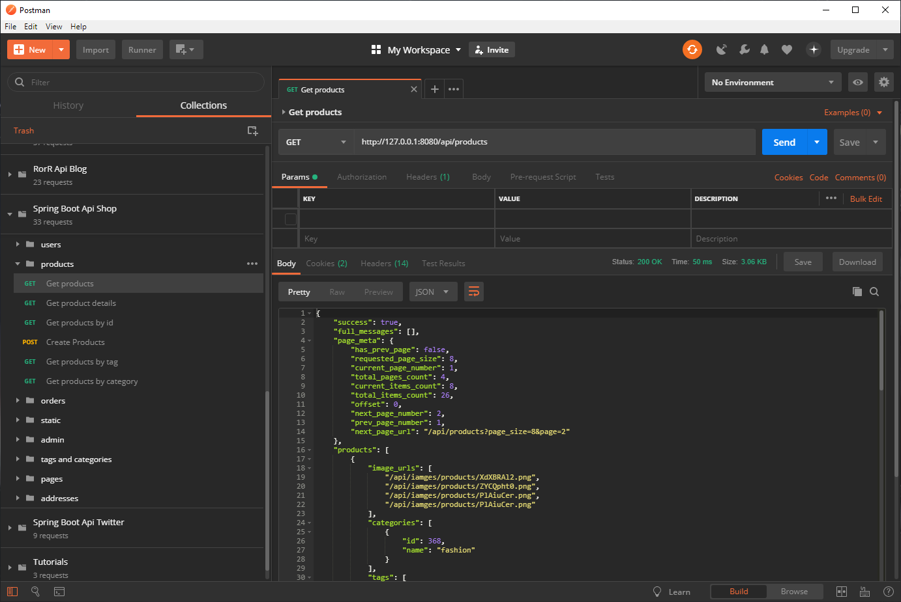
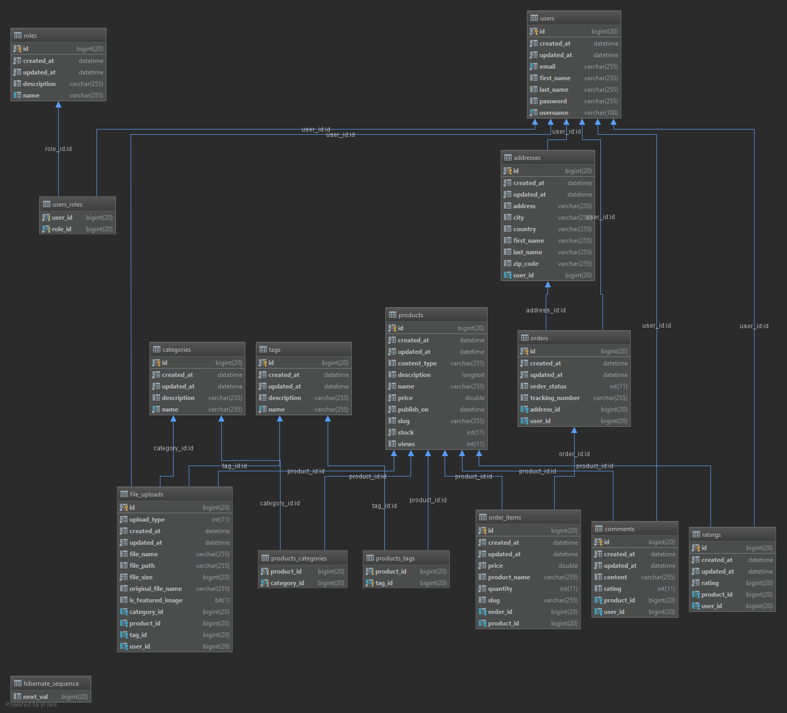

# Spring Boot E-commerce API
# Table of Contents
- [Introduction](#introduction)
- [Full-stack Applications](#full-stack-applications)
  * [E-commerce (shopping cart)](#e-commerce-shopping-cart)
    + [Server side implementations](#server-side-implementations)
    + [Client side implementations](#client-side-implementations)
  * [Blog/CMS](#blogcms)
    + [Server side implementations](#server-side-implementations-1)
    + [Client side](#client-side)
      - [The next come are](#the-next-come-are)
  * [Simple CRUD(Create, Read, Update, Delete)](#simple-crudcreate-read-update-delete)
    + [Server side implementations](#server-side-implementations-2)
    + [Client side implementations](#client-side-implementations-1)
      - [The next come are](#the-next-come-are-1)
  * [CRUD + Pagination](#crud--pagination)
    + [Server side implementations](#server-side-implementations-3)
      - [The next come are](#the-next-come-are-2)
    + [Client side implementations](#client-side-implementations-2)
      - [The next come are](#the-next-come-are-3)
- [Follow me](#social-media-links)
    
# Introduction
This is one of my E-commerce API app implementations. It is written in Java using Spring Boot and Hibernate as the main dependencies.
This is not a finished project by any means, but it has a valid enough shape to be git cloned and studied if you are interested in this topic.
If you are interested in this project take a look at my other server API implementations I have made with:

# Full-stack Applications
## E-commerce (shopping cart)
### Server side implementations
- [Spring Boot + Spring Data Hibernate](https://github.com/melardev/SBootApiEcomMVCHibernate)
- [Spring Boot + JAX-RS Jersey + Spring Data Hibernate](https://github.com/melardev/SpringBootEcommerceApiJersey)
- [Node Js + Sequelize](https://github.com/melardev/ApiEcomSequelizeExpress)
- [Node Js + Bookshelf](https://github.com/melardev/ApiEcomBookshelfExpress)
- [Node Js + Mongoose](https://github.com/melardev/ApiEcomMongooseExpress)
- [Python Django](https://github.com/melardev/DjangoRestShopApy)
- [Flask](https://github.com/melardev/FlaskApiEcommerce)
- [Golang go gonic](https://github.com/melardev/api_shop_gonic)
- [Ruby on Rails](https://github.com/melardev/RailsApiEcommerce)
- [AspNet Core](https://github.com/melardev/ApiAspCoreEcommerce)
- [Laravel](https://github.com/melardev/ApiEcommerceLaravel)

The next to come are:
- Spring Boot + Spring Data Hibernate + Kotlin
- Spring Boot + Jax-RS Jersey + Hibernate + Kotlin
- Spring Boot + mybatis
- Spring Boot + mybatis + Kotlin
- Asp.Net Web Api v2
- Elixir
- Golang + Beego
- Golang + Iris
- Golang + Echo
- Golang + Mux
- Golang + Revel
- Golang + Kit
- Flask + Flask-Restful
- AspNetCore + NHibernate
- AspNetCore + Dapper

### Client side implementations
This client side E-commerce application is also implemented using other client side technologies:
- [React Redux](https://github.com/melardev/ReactReduxEcommerceRestApi)
- [React](https://github.com/melardev/ReactEcommerceRestApi)
- [Vue](https://github.com/melardev/VueEcommerceRestApi)
- [Vue + Vuex](https://github.com/melardev/VueVuexEcommerceRestApi)
- [Angular](https://github.com/melardev/AngularEcommerceRestApi)

## Blog/CMS
### Server side implementations
- [Spring Boot + Spring Data Hibernate](https://github.com/melardev/SpringBootApiBlog)
- [Go + Gin Gonic](https://github.com/melardev/GoGonicBlogApi)
- [NodeJs + Mongoose](https://github.com/melardev/ApiBlogExpressMongoose)
- [Laravel](https://github.com/melardev/LaravelApiBlog)
- [Ruby on Rails + JBuilder](https://github.com/melardev/RailsApiBlog)
- [Django + Rest-Framework](https://github.com/melardev/DjangoApiBlog)
- [Asp.Net Core](https://github.com/melardev/AspCoreApiBlog)
- [Flask + Flask-SQLAlchemy](https://github.com/melardev/FlaskApiBlog)

The next to come are:
- Spring Boot + Spring Data Hibernate + Kotlin
- Spring Boot + Jax-RS Jersey + Hibernate + Kotlin
- Spring Boot + mybatis
- Spring Boot + mybatis + Kotlin
- Asp.Net Web Api v2
- Elixir
- Golang + Beego
- Golang + Iris
- Golang + Echo
- Golang + Mux
- Golang + Revel
- Golang + Kit
- Flask + Flask-Restful
- AspNetCore + NHibernate
- AspNetCore + Dapper

### Client side
- [Vue + Vuex](https://github.com/melardev/VueVuexBlog)
- [Vue](https://github.com/melardev/VueBlog)
- [React + Redux](https://github.com/melardev/ReactReduxBlog)
- [React](https://github.com/melardev/ReactBlog)
- [Angular](https://github.com/melardev/AngularBlog)

The next come are
- Angular NgRx-Store
- Angular + Material
- React + Material
- React + Redux + Material
- Vue + Material
- Vue + Vuex + Material
- Ember

## Simple CRUD(Create, Read, Update, Delete)
### Server side implementations
- [Spring Boot + Spring Data Hibernate](https://github.com/melardev/SpringBootApiJpaCrud)
- [Spring boot + Spring Data Reactive Mongo](https://github.com/melardev/SpringBootApiReactiveMongoCrud)
- [Spring Boot + Spring Data Hibernate + Jersey](https://github.com/melardev/SpringBootApiJerseySpringDataCrud)
- [NodeJs Express + Mongoose](https://github.com/melardev/ExpressMongooseApiCrud)
- [Nodejs Express + Bookshelf](https://github.com/melardev/ExpressBookshelfApiCrud)
- [Nodejs Express + Sequelize](https://github.com/melardev/ExpressSequelizeApiCrud)
- [Go + Gin-Gonic + Gorm](https://github.com/melardev/GoGinGonicApiGormCrud)
- [Ruby On Rails](https://github.com/melardev/RailsApiCrud)
- [Ruby On Rails + JBuilder](https://github.com/melardev/RailsApiJBuilderCrud)
- [Laravel](https://github.com/melardev/LaravelApiCrud)
- [AspNet Core](https://github.com/melardev/AspNetCoreApiCrud)
- [AspNet Web Api 2](https://github.com/melardev/AspNetWebApiCrud)
- [Python + Flask](https://github.com/melardev/FlaskApiCrud)
- [Python + Django](https://github.com/melardev/DjanogApiCrud)
- [Python + Django + Rest Framework](https://github.com/melardev/DjangoRestFrameworkCrud)

### Client side implementations
- [VueJs](https://github.com/melardev/VueAsyncCrud)

#### The next come are
- Angular NgRx-Store
- Angular + Material
- React + Material
- React + Redux + Material
- Vue + Material
- Vue + Vuex + Material
- Ember
- Vanilla javascript

## CRUD + Pagination
### Server side implementations
- [Spring Boot + Spring Data + Jersey](https://github.com/melardev/SpringBootJerseyApiPaginatedCrud)
- [Spring Boot + Spring Data](https://github.com/melardev/SpringBootApiJpaPaginatedCrud)
- [Spring Boot Reactive + Spring Data Reactive](https://github.com/melardev/ApiCrudReactiveMongo)
- [Go with Gin Gonic](https://github.com/melardev/GoGinGonicApiPaginatedCrud)
- [Laravel](https://github.com/melardev/LaravelApiPaginatedCrud)
- [Rails + JBuilder](https://github.com/melardev/RailsJBuilderApiPaginatedCrud)
- [Rails](https://github.com/melardev/RailsApiPaginatedCrud)
- [NodeJs Express + Sequelize](https://github.com/melardev/ExpressSequelizeApiPaginatedCrud)
- [NodeJs Express + Bookshelf](https://github.com/melardev/ExpressBookshelfApiPaginatedCrud)
- [NodeJs Express + Mongoose](https://github.com/melardev/ExpressApiMongoosePaginatedCrud)
- [Python Django](https://github.com/melardev/DjangoApiCrudPaginated)
- [Python Django + Rest Framework](https://github.com/melardev/DjangoRestFrameworkPaginatedCrud)
- [Python Flask](https://github.com/melardev/FlaskApiPaginatedCrud)
- [AspNet Core](https://github.com/melardev/AspNetCoreApiPaginatedCrud)
- [AspNet Web Api 2](https://github.com/melardev/WebApiPaginatedAsyncCrud)

#### The next come are
- NodeJs Express + Knex
- Flask + Flask-Restful
- Laravel + Fractal
- Laravel + ApiResources
- Go with Mux
- AspNet Web Api 2
- Jersey
- Elixir

### Client side implementations
- [Angular](https://github.com/melardev/AngularPaginatedAsyncCrud)
- [React-Redux](https://github.com/melardev/ReactReduxPaginatedAsyncCrud)
- [React](https://github.com/melardev/ReactAsyncPaginatedCrud)
- [Vue + Vuex](https://github.com/melardev/VueVuexPaginatedAsyncCrud)
- [Vue](https://github.com/melardev/VuePaginatedAsyncCrud)

#### The next come are
- Angular NgRx-Store
- Angular + Material
- React + Material
- React + Redux + Material
- Vue + Material
- Vue + Vuex + Material
- Ember
- Vanilla javascript

# Social media links
- [Youtube Channel](https://youtube.com/melardev) I publish videos mainly on programming
- [Blog](http://melardev.com) Sometimes I publish the source code there before Github
- [Twitter](https://twitter.com/@melardev) I share tips on programming

## WARNING
I have mass of projects to deal with so I make some copy/paste around, if something I say is missing or is wrong, then I apologize
and you may let me know opening an issue.

# Getting started
As with most node js projects, do the following
1. git clone
2. open src/java/resources/application.yml and change the database info to yours, and ddl-auto to create
3. Then to seed you have to pass seeds as the first argument to the application, in intelliJ it is done easily, 
just go to `Run > Edit Configuration`, copy the run config for the default Spring Boot application which automatically appeared in IntelliJ,
now move to copied configuration change the name to whatever you want, expand the Environment tree, and add write seeds in program arguments:

4. Then switch back to application.yml change dd-auto to update, change the run config to the default, and run the app.
If you did not understood the above steps, then it is easy, go to DbSeeder.java, comment this: `@Profile("seeds")` and run the app,
you don't have to pass any args, the seeding process will always run, but don't worry, the seeding code checks if it has seeded before and
only seeds if it does not.

5. You can also open the api.postman_collection.json file in postman and begin issuing requests

# Features
- Authentication / Authorization
- Paging
- Admin feature (incomplete)
- CRUD operations on products, comments, tags, categories

- Orders, guest users may place an order

# What you will learn
- Spring Boot
- Spring Web
    - JWT
    - Controllers
    - Filters
- Spring Security
- Spring Data
- Hibernate ORM
    - associations: ManyToMany, OneToMany, ManyToOne
    - transient fields
    - complex queries
    
- seed data with faker

- misc
    - project structure

# Understanding the project
The project is meant to be educational, to learn something beyond the hello world thing we find in a lot, lot of 
tutorials and blog posts. Since its main goal is educational, I try to make as much use as features of APIs, in other
words, I used different code to do the same thing over and over, there is some repeated code but I tried to be as unique
as possible so you can learn different ways of achieving the same goal.

Project structure:
- models: Mvc, it is our domain data.
- dtos: it contains our serializers, they will create the response to be sent as json. They also take care of validating the input(feature incomplete)
- controllers: well this is the mvC, our business logic.
- config: the web and security configurers.
- seeds: contains the file that seeds the database.
- uploads: a folder that will be generated when you create a product or tag or category with images
- errors: it contains the app exception handler and some custom exception classes
- services: contains some business logic for each model, and for authorization
- repositories: perform the crud operations on the database using Spring Data repositories
- annotations: contains an annotation used for confirming password and password confirmation

# TODO
- Security config antMatchers + hasRole(ADMIN) does not work, I have to use PreAuthorize as a workaround
- For the moment I have not filtered any input, the next commit will sanitize any input from untrusted users.
- Delete Product feature, does not work because of FK issues
- Improve SQL query:
    - get Orders
    - getting product associations, it must to join instead of fetching everything in a separate query
- OrderControllers::checkout() does not work with @Valid, fix
- Show how many times a product was bought in Product JSON List and details
- It is cool to use slug for urls for pretty urls but, for POST/PUT/DELETE 
requests it is better to use Ids for performance so we can retrierve the Hibernate Proxy, anyways, the client side app will not show the ugly /users/:pid/comments/:id url
- Write a validation routine for CheckoutDto, it has to validate depending
on if addressId is set or not. if it is set, we have to use it.
- Improve User Responses, return orders count, comments count
- Refactor the ErrorResponse parsing, it should take only meaningful messages from bindingResult.getModel()
otherwise app crashes ..
- Change authorization logic from Enum based(AuthorizationPolicy) to role name based (incomplete)

# Resources
- 